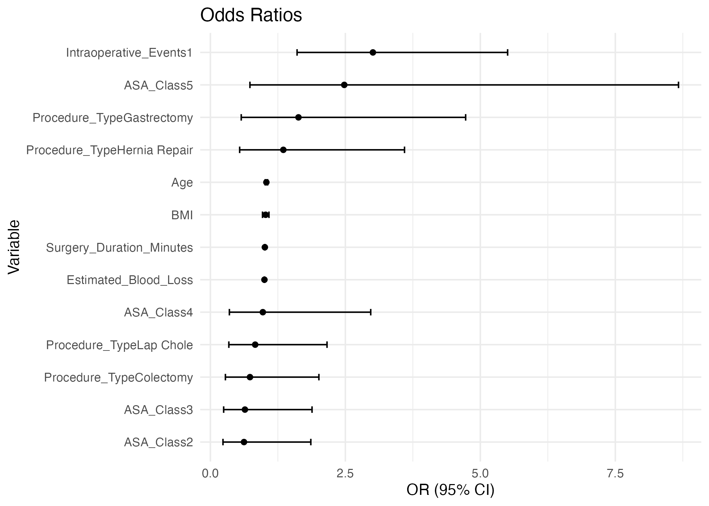
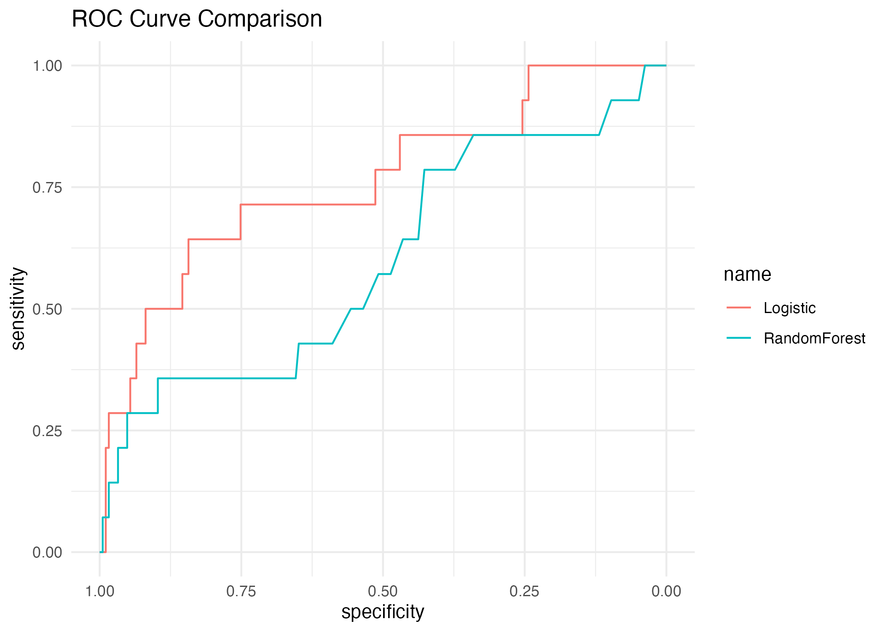

# 🧠 SDSC Analytic Pitch: Complication Risk Modeling Prototype

This project demonstrates how I would approach high-impact, explainable modeling at the Surgical Data Science Collective. I simulated realistic surgical outcomes data and built a prototype to predict 30-day complications using logistic regression and a random forest model.

🎯 **Goal**: Show how interpretable modeling of surgical data can reveal actionable risk insights for post-operative complications—and how it could scale into surgeon-facing decision support.

------------------------------------------------------------------------

## 📊 Key Features

-   ✅ **Simulated dataset** of 1,000 surgical cases (age, BMI, ASA class, blood loss, etc.)
-   ✅ **Logistic regression model** with clear odds ratios and confidence intervals
-   ✅ **Random forest model** for ML comparison
-   ✅ **ROC curve comparison** and confusion matrices

------------------------------------------------------------------------

## 🔍 Sample Output

### Odds Ratios from Logistic Model

### ROC Curve: Logistic vs. Random Forest

------------------------------------------------------------------------

## 📄 Full 1-Page Summary Report

👉 [View the full interactive report (HTML)](surgical_model_summary.html)

------------------------------------------------------------------------

## 🧬 Next Steps

If advanced with real surgical video data, this framework could: - Benchmark performance across surgeon cohorts - Link intraoperative events to long-term outcomes - Serve as a foundation for a feedback dashboard or AI assistant

------------------------------------------------------------------------

## 🧑‍💻 Author

Walker Blackston\
[GitHub](https://github.com/jwblackston) · [LinkedIn](https://www.linkedin.com/in/walkerblackston) · [Email](mailto:walker.blackston@gmail.com)

------------------------------------------------------------------------

> This project is part of a pitch to join SDSC’s mission to improve surgical outcomes through data-driven insights.
